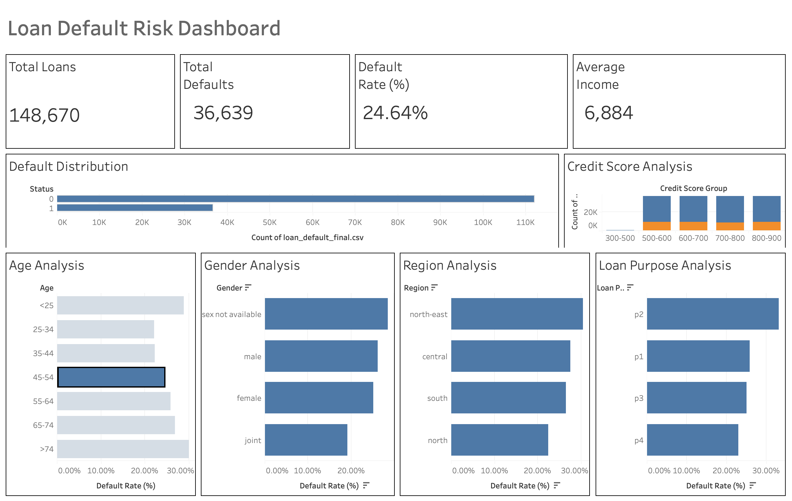

# Loan Default Risk Analysis Dashboard

An end-to-end financial risk analysis project that explores **148,670 loan applications** to identify default patterns across demographics, credit profiles, and loan characteristics. The workflow moves from Python-based data cleaning and EDA through MySQL analytics to an interactive Tableau dashboard.



## Key Metrics

| Metric | Value |
|---|---|
| Total Loans | 148,670 |
| Total Defaults | 36,639 |
| Default Rate | 24.64% |
| Average Income | $6,884 |

## Highlights

- **Default distribution:** ~75% of loans are non-default (Status 0); ~25% default (Status 1).
- **Credit score:** Default rates vary across score bands (300–500 through 800–900), with lower-score groups carrying higher risk.
- **Demographics:** Joint applications show the lowest default rate (~20%); `sex not available` and male borrowers trend higher (~27–28%).
- **Geography:** Default rates differ by region — highest in the north-east, lowest in the north.
- **Loan purpose:** Purpose codes `p1`–`p4` show distinct default-rate profiles, with `p2` among the highest-risk categories.

## Tech Stack

| Layer | Tools |
|---|---|
| Data processing & EDA | Python, pandas, NumPy, matplotlib, seaborn, missingno |
| Database | MySQL |
| Visualization | Tableau |
| Version control | Git / GitHub |

## Project Structure

```
Financial-Dashboard/
├── data/
│   ├── raw/                          # Source dataset (Loan_Default.csv)
│   └── processed/
│       ├── loan_default_cleaned.csv  # Output of preprocessing notebook
│       └── loan_default_final.csv    # Final dataset with engineered features
├── notebooks/
│   ├── Data_Preprocessing.ipynb      # Cleaning, profiling, deduplication
│   └── EDA.ipynb                     # Exploratory analysis & feature engineering
├── sql/
│   ├── schema.sql                    # Database setup
│   ├── views.sql                     # Reusable analytical views
│   └── queries.sql                   # 16 ad-hoc analysis queries
├── dashboard/
│   ├── tableau_dashboard.twb         # Tableau workbook
│   ├── tableau_dashboard.twbx        # Packaged Tableau workbook
│   └── dashboard.png                 # Dashboard screenshot
├── loan_data.csv                     # Dataset prepared for MySQL import
├── requirements.txt
└── README.md
```

## Data Pipeline

1. **Raw data** — `data/raw/Loan_Default.csv` (34 columns, 148,670 rows).
2. **Preprocessing** (`notebooks/Data_Preprocessing.ipynb`) — inspects missing values, removes duplicates, separates numeric and categorical columns, and exports `loan_default_cleaned.csv`.
3. **EDA** (`notebooks/EDA.ipynb`) — analyzes default distribution, income, loan amount, gender, age, region, and loan purpose; engineers a `CreditScoreGroup` column (bins: 300–500, 500–600, 600–700, 700–800, 800–900); exports `loan_default_final.csv`.
4. **SQL layer** — final dataset loaded into MySQL as `loan_data` for querying and views.
5. **Dashboard** — Tableau connects to the processed data to surface KPIs and breakdowns by credit score, age, gender, region, and loan purpose.

### Dataset Columns (final)

`ID`, `year`, `loan_limit`, `Gender`, `approv_in_adv`, `loan_type`, `loan_purpose`, `Credit_Worthiness`, `open_credit`, `business_or_commercial`, `loan_amount`, `rate_of_interest`, `Interest_rate_spread`, `Upfront_charges`, `term`, `Neg_ammortization`, `interest_only`, `lump_sum_payment`, `property_value`, `construction_type`, `occupancy_type`, `Secured_by`, `total_units`, `income`, `credit_type`, `Credit_Score`, `co-applicant_credit_type`, `age`, `submission_of_application`, `LTV`, `Region`, `Security_Type`, `Status`, `dtir1`, `CreditScoreGroup`

`Status` is the target variable: `0` = no default, `1` = default.

## Getting Started

### Prerequisites

- Python 3.10+
- MySQL Server
- Tableau Desktop (to open `.twb` / `.twbx` workbooks)
- Jupyter Notebook

### Python environment

```bash
pip install -r requirements.txt
jupyter notebook
```

Run the notebooks in order:

1. `notebooks/Data_Preprocessing.ipynb`
2. `notebooks/EDA.ipynb`

### MySQL setup

```bash
mysql -u root -p < sql/schema.sql
```

Create and load the `loan_data` table from the processed CSV:

```sql
USE loan_dashboard;

CREATE TABLE loan_data (
    ID INT,
    year INT,
    loan_limit VARCHAR(10),
    Gender VARCHAR(30),
    approv_in_adv VARCHAR(10),
    loan_type VARCHAR(10),
    loan_purpose VARCHAR(10),
    Credit_Worthiness VARCHAR(5),
    open_credit VARCHAR(10),
    business_or_commercial VARCHAR(10),
    loan_amount INT,
    rate_of_interest DOUBLE,
    Interest_rate_spread DOUBLE,
    Upfront_charges DOUBLE,
    term DOUBLE,
    Neg_ammortization VARCHAR(15),
    interest_only VARCHAR(10),
    lump_sum_payment VARCHAR(10),
    property_value DOUBLE,
    construction_type VARCHAR(5),
    occupancy_type VARCHAR(5),
    Secured_by VARCHAR(10),
    total_units VARCHAR(5),
    income DOUBLE,
    credit_type VARCHAR(10),
    Credit_Score INT,
    `co-applicant_credit_type` VARCHAR(10),
    age VARCHAR(10),
    submission_of_application VARCHAR(15),
    LTV DOUBLE,
    Region VARCHAR(20),
    Security_Type VARCHAR(10),
    Status INT,
    dtir1 DOUBLE,
    CreditScoreGroup VARCHAR(15)
);

LOAD DATA LOCAL INFILE 'loan_data.csv'
INTO TABLE loan_data
FIELDS TERMINATED BY ','
ENCLOSED BY '"'
LINES TERMINATED BY '\n'
IGNORE 1 ROWS;
```

Apply views and run analysis queries:

```bash
mysql -u root -p loan_dashboard < sql/views.sql
mysql -u root -p loan_dashboard < sql/queries.sql
```

### Tableau dashboard

Open `dashboard/tableau_dashboard.twbx` in Tableau Desktop. The workbook is built on `loan_default_final.csv` and includes:

- KPI cards (total loans, defaults, default rate, average income)
- Default distribution chart
- Credit score analysis
- Default rate by age, gender, region, and loan purpose

## SQL Analytics

### Views (`sql/views.sql`)

| View | Description |
|---|---|
| `vw_default_distribution` | Loan counts by default status |
| `vw_gender_analysis` | Customers and defaults by gender |
| `vw_age_analysis` | Customers and defaults by age group |
| `vw_creditscore_analysis` | Customers and defaults by credit score band |
| `vw_loanpurpose_analysis` | Customers and defaults by loan purpose |

### Sample queries (`sql/queries.sql`)

The query file includes 16 analyses covering:

- Overall default rate and average loan amount
- Default rate by gender, age, credit score, region, and loan purpose
- Average income by default status and credit score group
- Cross-tabulation of age and credit score against defaults

Example — overall default rate:

```sql
SELECT
    ROUND(
        SUM(CASE WHEN Status = 1 THEN 1 ELSE 0 END) * 100.0 / COUNT(*),
        2
    ) AS DefaultRate
FROM loan_data;
```

## License

This project is for educational and portfolio purposes.
